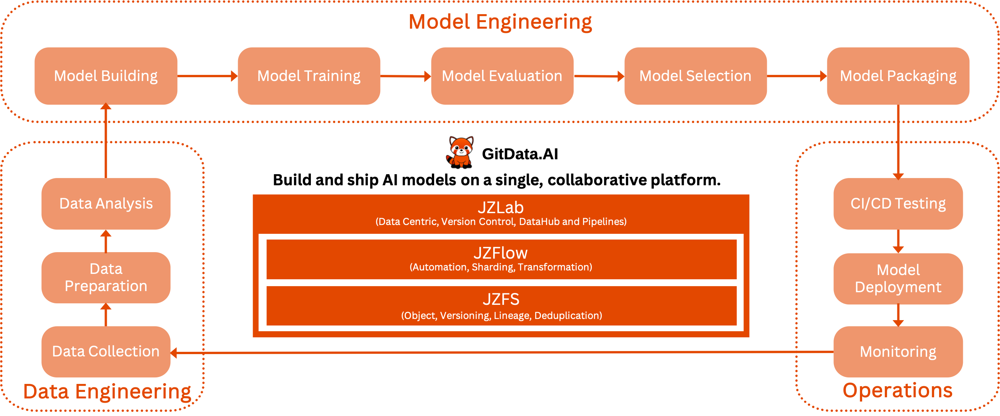

# Welcome to GitData.AI!

## GitData.AI Cloud
### _- Build, Manage and Share - Fire up your passion and creativity in Data and AI._
* Global: [https://gitdata.ai](https://gitdata.ai)
* China: [https://gitdata.cn](https://gitdata.cn)

## GitData.AI Enterprise 
### _- Build and ship AI Models on a single, collaborative platform._

[GitData.AI](https://gitdata.ai) is an open source team to build cost-effective at scale MLOps platforms which enable data engineering teams to automate complex pipelines with sophisticated data transformations deeply intertwined with the data itself. 

We take the unique composable modular approach to build the entire MLOps platform: 
1. JZFS: Git-like version control filesystem for dataset management with data lineage tracking. 
2. JZFlow: Parallelized processing of multi-stage, language-agnostic pipelines with data versioning.
3. JZLab: Self-hosted MLOps platform with infrastructure orchestration,visualization and interaction.

GitData.AI delivers the ultimate CI/CD/CT engine for MLOps.
